# Website Recreation Plan: SpacecraftReplicas.com (Plan 2)

> [!NOTE]
> This plan details the architectural and web design strategy to recreate **SpacecraftReplicas.com** using all recovered content, photos, and PDF files from `/workspaces/spacecraftreplicas/recovered_site`.
> 
> **Core Directives**:
> 1. **Simple yet Modern Design**: Clean aerospace-themed UI, responsive CSS Grid/Flexbox, glassmorphism cards, dark mode aesthetics, and Inter/Outfit typography.
> 2. **100% Content Preservation**: Complete preservation of original text, FAQs (12,000+ characters), build guides, CNC router documentation, Hallmark ornament history, and Mercury spacecraft section descriptions.
> 3. **Original Navigation Structure**: Faithful recreation of the original site's navigation menus grouped into intuitive categories.
> 4. **Clean File Organization**: Structured folder layout isolating pages, assets, CSS, JS, images, and PDFs in a modular `/site` workspace.

---

## 🏗️ Architecture & Directory Organization

```
/workspaces/spacecraftreplicas/site/
├── index.html                           # Modern Homepage (Hero, Quick Nav, Featured Models)
├── assets/
│   ├── css/
│   │   └── main.css                     # Shared Design System (tokens, dark mode, responsive grid)
│   ├── js/
│   │   └── main.js                      # Navigation, lightbox modal, search & filter logic
│   ├── images/                          # Restored model photos & diagrams
│   └── pdfs/                            # 112 downloadable PDF blueprints & schematics
└── pages/
    ├── mercury/                         # Project Mercury Replica Section
    │   ├── main-structure.html          # Main Capsule Framework
    │   ├── heat-shield.html             # Heat Shield Construction
    │   ├── shingles.html                # Exterior Corrugated Shingles
    │   ├── aft-bulkhead.html            # Aft Bulkhead Assembly
    │   ├── instrument-panels.html       # Cockpit Instrument Panels
    │   ├── periscope.html               # Periscope Assembly & Fixtures
    │   ├── antenna-fairing.html         # Top Antenna Fairing
    │   ├── recovery-section.html        # Parachute Recovery System
    │   └── hallmark.html                # Hallmark Friendship 7 Ornament Mod
    ├── shuttle/                         # Space Shuttle & Experimental Craft
    │   ├── 1-40-shuttle.html            # 1:40 Scale Space Shuttle Build
    │   └── x-37-x-40.html               # X-37 & X-40A Glide Lander Project
    ├── paper-models/                    # Paper Craft Kits & Blueprints
    │   ├── index.html                   # Paper Craft Overview & Instructions
    │   ├── blueprints.html              # Full Searchable PDF Blueprint Library (96+ PDFs)
    │   └── videos.html                  # Build Videos & Demonstrations
    ├── community/                       # Community & Special Projects
    │   ├── builders.html                # Community Builders Showcase
    │   ├── collectspace.html            # CollectSpace Forum Collaboration
    │   ├── cnc-router.html              # Custom CNC Router Build Guide
    │   └── homebuilts.html              # Homebuilt Aircraft & Aviation Projects
    ├── about.html                       # Story of Andy & SpacecraftReplicas
    ├── faq.html                         # Comprehensive FAQ (All Q&As Preserved)
    └── contact.html                     # Contact Form & Community Information
```

---

## 🎨 Web Design System & Aesthetics

### 1. Color Palette & Design Tokens
- **Background Dark**: `#090d16` (Deep space dark)
- **Card Background**: `rgba(22, 30, 46, 0.75)` (Glassmorphism effect)
- **Primary Accent**: `#38bdf8` (Cosmic Cyan)
- **Secondary Accent**: `#f59e0b` (Solar Gold)
- **Text Main**: `#f8fafc` / Text Muted: `#94a3b8`
- **Border Color**: `rgba(255, 255, 255, 0.1)`

### 2. Typography & Layout
- **Headings**: `Outfit`, sans-serif (Bold, futuristic aerospace feel)
- **Body Text**: `Inter`, sans-serif (High contrast, clean readability)
- **Layout**: Flexible CSS Grid with responsive breakpoints (`@media (max-width: 768px)`).

---

## 🗺️ Navigation Mapping (Preserving Original Site Structure)

```mermaid
flowchart TD
    Nav[Site Navigation Bar] --> Home[Home]
    
    Nav --> Mercury[Project Mercury ▾]
    Mercury --> M1[Main Structure]
    Mercury --> M2[Heat Shield]
    Mercury --> M3[Shingles]
    Mercury --> M4[Aft Bulkhead]
    Mercury --> M5[Instrument Panels]
    Mercury --> M6[Periscope]
    Mercury --> M7[Antenna Fairing]
    Mercury --> M8[Recovery Section]
    Mercury --> M9[Hallmark Ornament]
    
    Nav --> Shuttle[Shuttle & X-37 ▾]
    Shuttle --> S1[1:40 Scale Shuttle]
    Shuttle --> S2[X-37 / X-40A Build]
    
    Nav --> Paper[Paper Models ▾]
    Paper --> P1[Paper Craft Overview]
    Paper --> P2[PDF Blueprint Library]
    Paper --> P3[Build Videos]
    
    Nav --> Community[Community & Projects ▾]
    Community --> C1[Builders Showcase]
    Community --> C2[CollectSpace]
    Community --> C3[CNC Router Build]
    Community --> C4[Homebuilt Aircraft]
    
    Nav --> About[About Andy]
    Nav --> FAQ[FAQ]
    Nav --> Contact[Contact]
```



---

## 📝 Text Content & Media Preservation Strategy

1. **Extraction Script (`build_site.py`)**:
   - Parses text content from `/workspaces/spacecraftreplicas/recovered_site/pages/`.
   - Cleans legacy boilerplate while retaining **100% of original body paragraphs**, build notes, and image captions.
   - Maps associated images from `/workspaces/spacecraftreplicas/recovered_site/assets/images/` to their relevant section pages.
   - Maps downloadable PDF schematics from `/workspaces/spacecraftreplicas/recovered_site/assets/pdfs/` to the Blueprint Library & specific model pages.

2. **Interactive Elements**:
   - **Image Lightbox Modal**: Click any photo to view full-resolution zoom.
   - **PDF Search & Filter**: Real-time filter input on the Blueprint Library page to quickly search blueprints (e.g. searching "periscope", "mercury", "panel", "cnc").
   - **Mobile Menu Drawer**: Smooth slide-out mobile navigation for smaller screens.

---

## 📋 Proposed Changes

### Component 1: Design System & Assets (`/site/assets/`)
- `[NEW] /site/assets/css/main.css`: Shared stylesheet containing design tokens, glassmorphism card components, grid layouts, navbar, lightbox, and typography.
- `[NEW] /site/assets/js/main.js`: Interactive navigation, mobile menu toggle, lightbox modal, and real-time PDF search.
- `[NEW] /site/assets/images/`: Organized copies of all 152 recovered image files.
- `[NEW] /site/assets/pdfs/`: Organized copies of all 112 recovered PDF documents.

### Component 2: Core Pages (`/site/index.html` & `/site/pages/`)
- `[NEW] /site/index.html`: Main landing page with Hero section, mission statement, featured models, and quick links.
- `[NEW] /site/pages/mercury/*.html`: 9 detailed subpages preserving Mercury capsule build sections.
- `[NEW] /site/pages/shuttle/*.html`: Shuttle 1:40 build notes and X-37 project.
- `[NEW] /site/pages/paper-models/*.html`: Paper craft hub, videos, and full PDF blueprint repository.
- `[NEW] /site/pages/community/*.html`: Builders gallery, CNC router guide, CollectSpace notes, and homebuilt aircraft.
- `[NEW] /site/pages/about.html`, `faq.html`, `contact.html`: Complete preservation of Andy's bio, FAQ Q&A, and contact information.

---

## 🧪 Verification Plan

### Automated Verification
1. Run Python link checker script to ensure zero broken links (`404`) across all pages.
2. Verify file counts: 100% of images (152) and PDFs (112) accessible in `/site/assets/`.

### Manual Verification
1. Test desktop and mobile navigation menus for dropdown usability and responsive layout.
2. Verify image lightbox and PDF downloads on sample pages (`paper-models/blueprints.html`, `mercury/periscope.html`).
